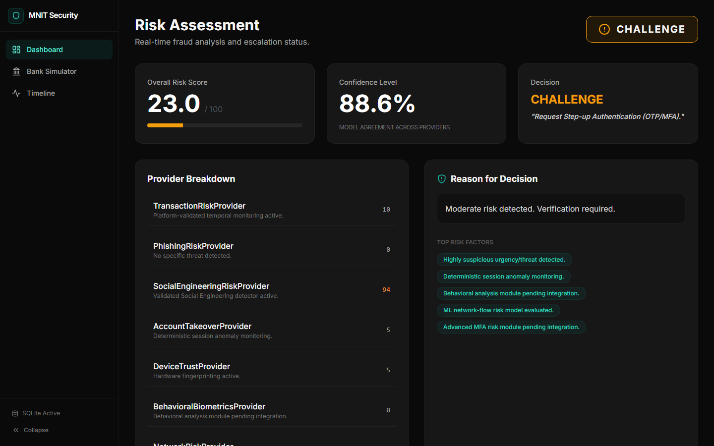
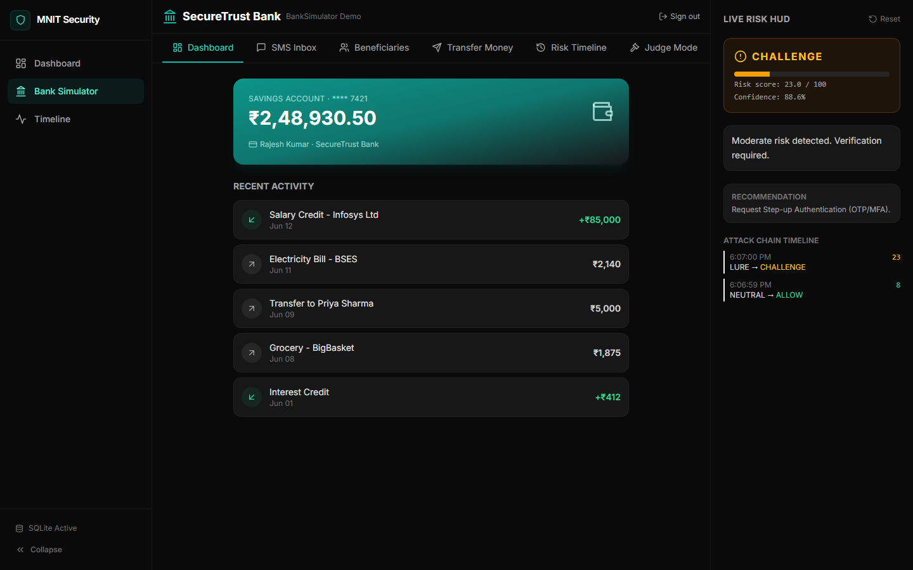
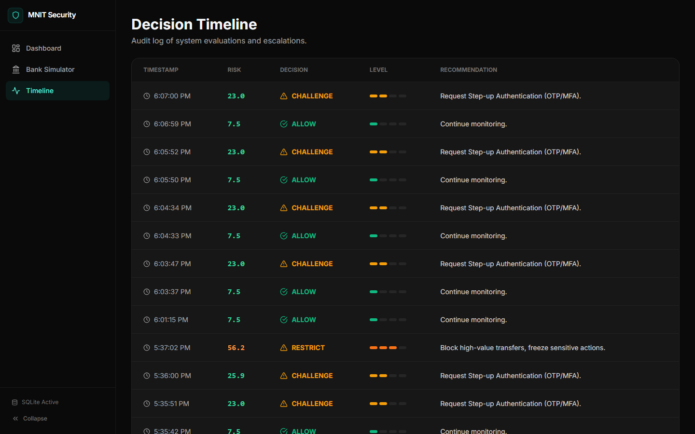
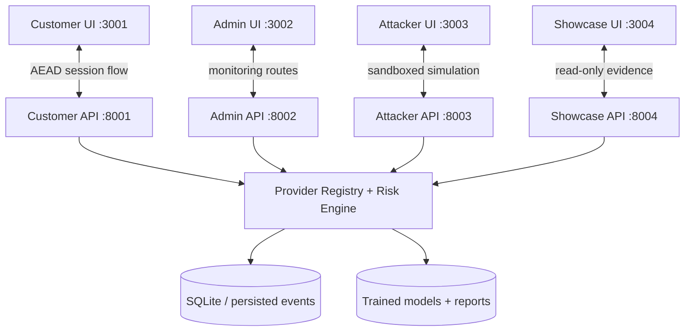

# AURA Banking Threat Detection Platform

AURA is a banking security demo platform for detecting account takeover, payment fraud, phishing, smishing, device-risk, and network-risk signals. It combines FastAPI services, React/Vite surfaces, provider-based ML scoring, and a risk escalation engine into a four-surface security simulation.

The project was built for an MNIT cyberhack context, but the repository is organized like a production prototype: isolated APIs, isolated user interfaces, model/report artifacts, dataset manifests, screenshots, and verification tests.

## Platform Preview

| Admin Risk Dashboard | Customer Banking Flow |
|:---:|:---:|
|  |  |

| Decision Timeline |
|:---:|
|  |

## What It Does

- Scores banking events with specialized providers for transaction risk, network risk, device trust, phishing, smishing, and account takeover signals.
- Fuses provider outputs into a unified decision: allow, challenge, restrict, or contain.
- Runs four isolated product surfaces so customer banking, admin monitoring, attacker simulation, and public research demos do not share the same frontend/backend boundary.
- Demonstrates attack chains such as smishing, suspicious login behavior, device compromise, and risky transfers.
- Preserves research evidence through dataset manifests, validation reports, model metrics, benchmark reports, and platform screenshots.

## Isolated Surfaces

The platform is split into four local surfaces. Each has its own FastAPI backend and Vite frontend.

| Surface | Frontend | Backend | Purpose |
|---|---:|---:|---|
| Customer Banking App | `http://localhost:3001` | `http://localhost:8001` | Customer login, account, beneficiary, SMS inbox, and transfer flows with encrypted session handling. |
| Admin Security Dashboard | `http://localhost:3002` | `http://localhost:8002` | Risk monitoring, model/provider visibility, event timelines, and investigation views. |
| Attacker Threat Simulator | `http://localhost:3003` | `http://localhost:8003` | Sandboxed threat-chain simulation using `sim_` data boundaries. |
| Showcase Research Portal | `http://localhost:3004` | `http://localhost:8004` | Read-only model, dataset, and evidence showcase for judges or reviewers. |



## Risk Providers

- **Transaction Risk**: evaluates payment amount, velocity, temporal patterns, and fraud-model outputs.
- **Network Risk**: identifies suspicious network/session characteristics and intrusion-like patterns.
- **Device Trust**: scores rooted or jailbroken devices, VPN/proxy usage, fingerprint drift, and device integrity signals.
- **Social Engineering Risk**: detects smishing and phishing indicators in SMS text, URLs, and related user context.
- **Account Takeover Signals**: combines login, behavior, device, and environment changes into an ATO-oriented risk view.

## Escalation Model

| Risk Level | Score Range | Decision | Typical Action |
|---|---:|---|---|
| Low | `< 0.20` | Allow | Transaction proceeds normally. |
| Moderate | `0.20 - 0.40` | Challenge | Require OTP, MFA, or biometric confirmation. |
| High | `0.40 - 0.70` | Restrict | Block high-value actions or freeze risky flows. |
| Critical | `> 0.70` | Contain | Terminate session, rotate keys, lock account, and escalate to SOC. |

## Quick Start

### 1. Create the Python environment

```bash
conda env create -f environment.yml
conda activate bank_threat
```

The launcher currently expects a local Windows virtual environment at `env\python.exe`. If you are using Conda only, either update `run.py` to call `python` or create a local `env` folder that matches your setup.

### 2. Install frontend dependencies

```bash
cd ui
npm install
cd ..
```

### 3. Launch all surfaces

```bash
python run.py
```

`run.py` clears the fixed local ports, starts the four FastAPI APIs, then starts the four Vite apps. Stop everything with `Ctrl+C`.

## Useful Commands

```bash
# Run backend/unit verification
python -m pytest tests

# Build the primary UI package
cd ui
npm run build

# Run one backend surface manually
python -m uvicorn src.api.customer_api:app --host 127.0.0.1 --port 8001

# Run one frontend surface manually
cd ui
npx vite -c surfaces/customer/vite.config.ts --host 127.0.0.1 --port 3001
```

## Repository Map

```text
src/api/              FastAPI entrypoints for customer, admin, attacker, and showcase surfaces
src/engine/           Provider registry, risk engine, feature logic, and session models
src/providers/        Transaction, network, device, context, and placeholder provider implementations
src/models/           Model wrappers and provider-specific ML integration
src/research/         Dataset acquisition, experiments, benchmarking, audit, and report generation
ui/surfaces/          Isolated React/Vite apps for customer, admin, attacker, and showcase experiences
ui/src/               Shared UI components and banking simulation modules
datasets/             Dataset manifests, metadata, schemas, citations, and selected raw assets
reports/              Validation reports, research evidence, model metrics, audits, and release notes
screenshots/          Current platform screenshots used in this README
tests/                Provider, feature, and surface-isolation tests
```

## Verification Checklist

After launching, confirm:

- Customer app opens at `http://localhost:3001`.
- Admin dashboard opens at `http://localhost:3002`.
- Attacker simulator opens at `http://localhost:3003`.
- Showcase portal opens at `http://localhost:3004`.
- `python -m pytest tests` passes.
- `cd ui && npm run build` completes.

## Notes for Reviewers

This repository contains both application code and research evidence. The app surfaces are the demo path; the `reports/` and `datasets/` folders explain where models, datasets, validation decisions, and benchmark claims came from.
