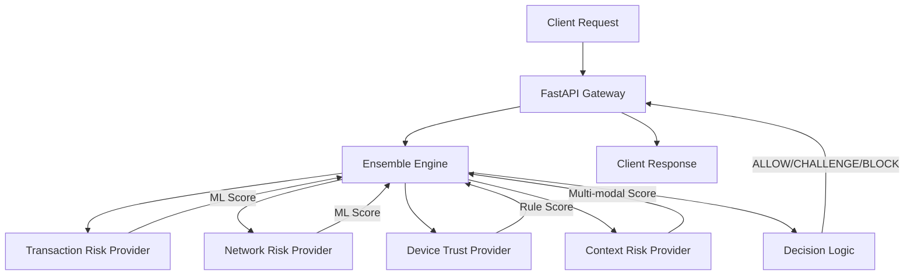

# Banking Threat Detection System

Modular ML system for detecting banking threats using Transaction Risk, Network Risk, Device Trust, and Context Risk.

## Platform Preview

| Risk Dashboard | Security Playground |
|:---:|:---:|
|  |  |

| Decision Timeline |
|:---:|
|  |

## Project Overview

The system fuses multiple risk signals into a unified threat score. It uses an ensemble of specialized providers to evaluate transaction safety, network anomalies, device integrity, and contextual/social engineering threats.

## Architecture



## Provider Descriptions

- **Transaction Risk:** Uses temporal ML models to detect anomalous spending patterns and high-value risks.
- **Network Risk:** Analyzes flow statistics to identify botnet or intrusion signatures.
- **Device Trust:** Rule-based evaluation of VPN usage, rooting/jailbreaking, and hardware fingerprint changes.
- **Context Risk:** Multi-modal analysis of SMS text (smishing) and URLs (phishing) combined with behavioral velocity.

## Risk Escalation Workflow

1.  **Low Risk (< 0.2):** ALLOW - Transaction proceeds normally.
2.  **Moderate Risk (0.2 - 0.4):** CHALLENGE - Request MFA/OTP or biometric verification.
3.  **High Risk (0.4 - 0.7):** RESTRICT - Block high-value actions, freeze account.
4.  **Critical Risk (> 0.7):** CONTAIN - Terminate session, lock account, escalate to SOC.

## Installation Instructions

1.  **Backend:**
    ```bash
    conda env create -f environment.yml
    conda activate bank_threat
    python src/api/main.py
    ```
2.  **Frontend:**
    ```bash
    cd ui
    npm install
    npm run dev
    ```

## Demo Instructions

1.  Start the Backend API (default port 8000).
2.  Start the Frontend UI (default port 5173 or 3000).
3.  Navigate to the UI to view the real-time threat detection dashboard.
4.  Use the "Simulate Threat" feature to see the risk fusion in action.

## Verification

To verify the system status:
- Backend: `curl http://localhost:8000/`
- Frontend: Open `http://localhost:3000/` in your browser.
