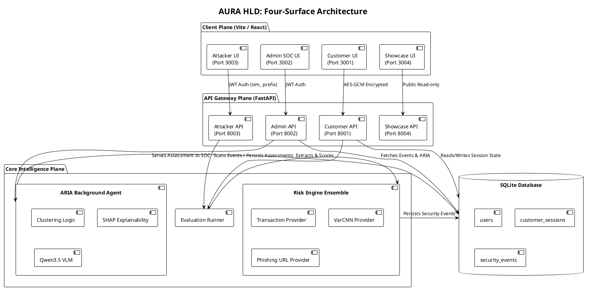
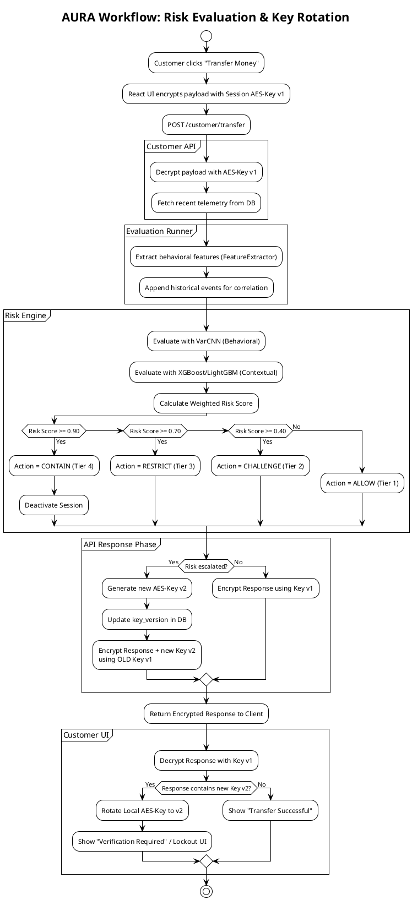

# AURA Platform: PlantUML High-Level Diagrams (HLD)

You can copy and paste these PlantUML codes into any PlantUML viewer (like PlantText.com or the VSCode PlantUML extension) to generate clean, professional diagrams for your technical documentation.

## 1. Component Diagram: Four-Surface Architecture
This High-Level Design (HLD) component diagram illustrates the strict isolation of the four Vite frontends and FastAPI backends, connecting to the shared centralized Risk Engine and Database.

---

## 2. Flowchart: Risk Evaluation & Key Rotation Workflow
This flowchart illustrates the step-by-step logic when a user makes a high-risk request, how the engine scores it, and how the cryptographic key rotation is executed.

