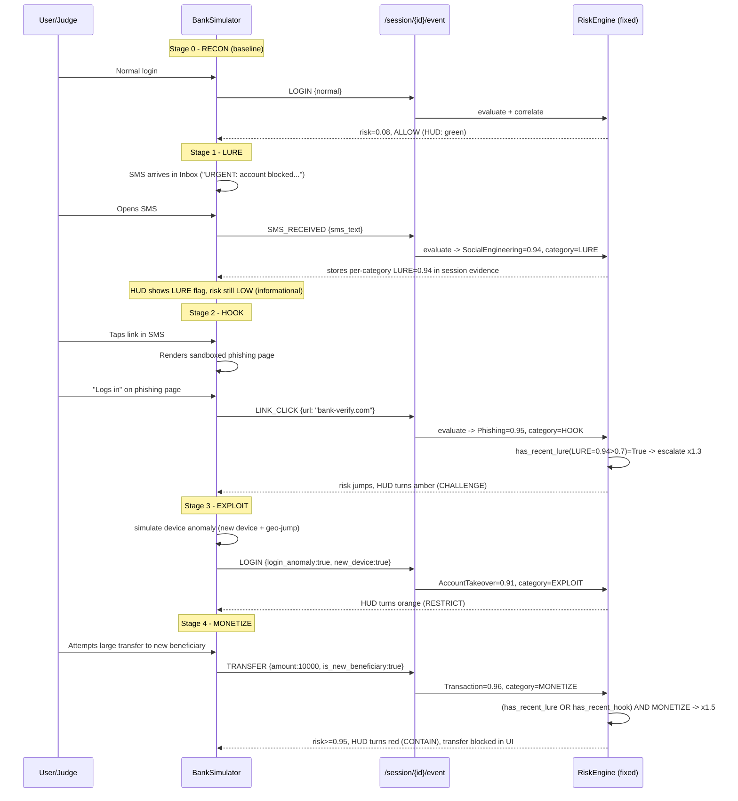

# Phase 28: Platform Engineering Review & Next-Generation Demo Design

**Role**: Principal Engineer / Systems Architect review.
**Method**: Static code review + live runtime verification (backend boot test, SQLite schema introspection, joblib model load test) performed on 2026-06-13.
**Scope**: Full Banking Threat Detection Platform (`src/`, `ui/`, `models/`, `reports/`).
**Constraints honored**: No model training. No commits. No code modifications. Evidence-based only — every finding below cites a file/line or a command output.

---

## 0. Source-of-Truth Reconciliation

`runtime_truth.md` is the nominal source of truth, but the working tree has **5 uncommitted files** (`git diff --stat`) that post-date it, and two other "release" reports (`end_to_end_validation.md`, `repository_completeness_audit.md`) describe a **different, legacy architecture** (the `main.py` / `EnsembleEngine` / port-8080 stack) as "fully operational." Per Rule 2 ("verify through code and runtime"), the table below reconciles all three:

| Claim | `runtime_truth.md` | Current code (incl. uncommitted) | Verified Now |
|---|---|---|---|
| Screenshots present | FALSE (empty dir) | `remediation_execution.md` claims fixed | **TRUE** — 3 PNGs exist (`ls reports/release/screenshots/`) |
| Frontend port | UNVERIFIED (8080 vs 8000) | App.tsx/SecurityPlayground/vite.config now default **8000** | **STILL BROKEN** — `ui/.env.local` (untracked, present on disk) still says `VITE_API_BASE=http://localhost:8080`, which **overrides** the 8000 default in Vite. See A.7. |
| `implementations.py` unused | PARTIALLY VERIFIED | `server.py` imports `TransactionRiskProvider, PhishingRiskProvider, SocialEngineeringRiskProvider, AccountTakeoverProvider, DeviceTrustProvider, NetworkRiskProvider` directly from `implementations.py` | **FALSE** — it is the active provider source. The claim was stale. |
| V2 models integrated | FALSE | `implementations.py` loads `transaction_fraud_v2_temporal.joblib`, `phishing_provider_candidate.joblib`, `network_provider_candidate.joblib`, `sms_scam_v2_dedup.joblib` | **Loaded but not used** — see A.3, a more serious finding than the original claim. |
| `end_to_end_validation.md` / `repository_completeness_audit.md` describe the live system | (not addressed) | Both describe `EnsembleEngine`/`main.py`/port 8080/`src.ensemble` | **STALE/WRONG** — `server.py` does not import `src.ensemble` at all. These two reports should be retired or marked historical; they will mislead anyone assessing "deployment readiness." |

**New runtime findings not in any prior report** (most are more severe than anything previously documented):

1. `sqlalchemy` is **not installed** in `./env` and **not listed** in `environment.yml`, yet `src/db/models.py` (imported by the active `server.py`) requires it. Verified: `uvicorn src.api.server:app` → `ModuleNotFoundError: No module named 'sqlalchemy'`.
2. The live `security_platform.db` schema is **missing `user_id`, `session_id`, `event_category`** columns that `src/db/models.py::SecurityEvent` declares. `Base.metadata.create_all()` never alters existing tables, so `/evaluate` will raise `OperationalError` on this exact DB file.
3. `catboost` is not installed (`transaction_fraud_v2_temporal.joblib`, `phishing_provider_candidate.joblib` fail to load — `ModuleNotFoundError: No module named 'catboost'`).
4. `scipy.special.cython_special` is **blocked by a Windows Application Control policy** in this environment, so `sms_scam_v2_dedup.joblib`, `network_provider_candidate.joblib`, `device_provider_candidate.joblib` fail to load (`ImportError: DLL load failed ... Application Control policy has blocked this file`).
5. All of the above failures are swallowed by bare `except: pass` blocks — **silent degradation**, invisible at `/health`.

These five items are the foundation of Priority 1 below.

---

## Part A — System Weakness Analysis

### A.1 Backend Architecture — Two competing stacks, one canonical

**Evidence**
- Active stack: `src/api/server.py` → `src/engine/risk_engine.py` (`RiskEngine`, `_apply_correlation`) → `src/providers/implementations.py` → `src/db/models.py` (SQLAlchemy/SQLite).
- Parallel legacy stack: `src/api/main.py` → `src/ensemble.py::EnsembleEngine` → `src/config_handler.py` (`config/config.yaml`) → `src/providers/{transaction,network,device,context}.py`.
- `run.py` (the documented launcher) only ever starts `src.api.server:app` — `main.py`/`ensemble.py` are dead at runtime, but remain fully present, importable, and described as "operational" in `reports/release/end_to_end_validation.md`.
- Two different decision vocabularies exist: `ALLOW/CHALLENGE/RESTRICT/CONTAIN` (new) vs `ALLOW/CHALLENGE/BLOCK` (legacy); two different config systems (`config/risk_weights.yaml` — doesn't exist, hardcoded fallback — vs `config/config.yaml` via `config_handler.load_config`/`save_config`).

**Impact**
A new contributor or judge inspecting the repo has no way to tell which stack is canonical without running it. `reports/release/*` actively asserts the wrong one is "production ready." Risk of someone editing `main.py`/`ensemble.py` expecting it to affect the demo (it won't), or vice versa.

**Root cause**
Iterative "Phase" development never retired the Phase-1 stack when the Phase-2 (stateful) stack replaced it; "no deletion" caution from remediation docs preserved both indefinitely.

**Proper engineering solution**
- Designate `src/api/server.py` + `src/engine/` + `src/providers/implementations.py` as the single canonical backend in a top-level `ARCHITECTURE.md`.
- Physically relocate `src/api/main.py`, `src/ensemble.py`, `src/config_handler.py`, and the now-superseded `src/providers/transaction.py`, `network.py`, `context.py`, `behavior_placeholder.py`, `placeholders.py` (after confirming, via grep, zero remaining imports) into `legacy/` — preserves history without polluting the active surface.
- Retire or clearly header-stamp `end_to_end_validation.md` and `repository_completeness_audit.md` as "Phase ≤20 / historical — superseded by runtime_truth.md".

**Estimated effort**: Low (structural move + grep verification), ~2–4 hours.

---

### A.2 Risk Engine — Weight dilution and a correlation threshold that can never fire

**Evidence (weight dilution, verified against live data)**

`risk_engine.py` default weights (used because `config/risk_weights.yaml` does not exist):
```python
{"TransactionRiskProvider": 0.4, "SocialEngineeringRiskProvider": 0.2,
 "PhishingRiskProvider": 0.15, "AccountTakeoverProvider": 0.15, "DeviceTrustProvider": 0.1}
```
Sum = 1.0. But `bootstrap_platform()` in `server.py` registers **8** providers. The 3 unweighted ones (`NetworkRiskProvider`, `BehavioralBiometricsProvider`, `AuthenticationRiskProvider`) fall through to `self.weights.get(name, 0.05)` → `total_weight = 1.15`.

Verified directly against `security_platform.db` row `id=9`: stored `confidence = 0.8422`. Recomputing `weighted_conf / total_weight` with the actual provider confidences from that row's `breakdown` JSON (`0.98·0.4 + 0.92·0.2 + 0.95·0.15 + 1.0·0.15 + 1.0·0.1 + 0·0.05 + 0·0.05 + 0·0.05 = 0.9685`; `0.9685 / 1.15 = 0.8422`) reproduces the stored value **exactly**. The platform is systematically under-reporting confidence by ~13%, and the same dilution applies to `overall_risk`.

**Evidence (correlation threshold, the bigger issue)**

`_apply_correlation` (`risk_engine.py:65-66`):
```python
has_recent_lure = any(e.event_category == "LURE" and e.risk_score > 0.7 for e in history[-5:])
has_recent_hook = any(e.event_category == "HOOK" and e.risk_score > 0.7 for e in history[-5:])
```
`e.risk_score` here is `SessionEvent.risk_score = e.overall_risk` (`server.py:84`) — the **aggregate weighted score of the whole past event**, not the sub-score of the provider that produced the LURE/HOOK category.

`SocialEngineeringRiskProvider`'s max contribution to `overall_risk` is bounded by its weight: `0.2 / 1.15 ≈ 0.174`. Even at `risk_score = 1.0` for SMS-scam detection, the *aggregate* `overall_risk` for a pure-smishing request cannot exceed roughly `0.174 + (small contributions from other near-zero providers)` — well under 0.7.

**Concrete trace (smishing scenario `{"sms_text": "URGENT: Your account is BLOCKED. Visit bank-verify.com now."}`):**
- SocialEngineering → 0.94, category=LURE
- All other providers → ≤0.1, category=NEUTRAL
- `base_score ≈ (0.1·0.4 + 0.94·0.2 + 0·0.15 + 0.05·0.15 + 0.05·0.1 + 0 + ~0.05·0.05 + 0) / 1.15 ≈ 0.21`
- Stored event: `event_category="LURE"`, `overall_risk≈0.21`.
- On the *next* request (user clicks the link → HOOK), `has_recent_lure` checks `0.21 > 0.7` → **False**. The "Risk elevated due to sequence: Previous SMISHING LURE followed by interaction" message — the platform's headline feature — **never fires** for the most realistic two-step demo flow.

**Impact**: **Critical.** The stateful attack-chain correlation — the single most-differentiating feature of this platform versus a plain classifier — is, as currently calibrated, **dead code in practice**. It can only fire in contrived single-request payloads that simultaneously set fields from multiple categories at scores >0.7, which is not how a multi-step demo (Part B) would naturally generate data.

**Root cause**: The correlation logic was written against "overall risk" semantics inherited from the old `EnsembleEngine` final-score model, but the category tags (`LURE`/`HOOK`/etc.) are emitted by individual providers whose *sub-scores* are what actually carry the "0.94 = definitely a scam SMS" signal. The two scales were never reconciled.

**Proper engineering solution**
1. **Weight normalization**: At `RiskEngine.__init__`, auto-normalize weights to sum to 1.0 over the *actually registered* provider set (`w_i' = w_i / sum(weights.get(p,0.05) for p in providers)`), or fail startup with a clear error if `config/risk_weights.yaml` doesn't enumerate every registered provider.
2. **Correlation on per-category sub-scores, not aggregate**: Persist each provider's `(event_category, risk_score)` pairs per event (the data already exists in `breakdown` JSON — just needs surfacing), and have `_apply_correlation` check the **max sub-score of providers that emitted LURE/HOOK in history**, not `overall_risk`. This is exactly the "Evidence Memory" concept already designed in `reports/research/attack_chain_architecture.md` §3 — it needs implementation, not invention.

**Estimated effort**: Medium — 1–2 days (engine refactor, small schema addition for per-category scores, unit tests for the threshold logic).

---

### A.3 Provider Architecture — "ML providers" that never call their models, and silent load failures

This is the most consequential finding in the audit.

**Evidence**

`src/providers/implementations.py` — the active provider set:

| Provider | Model loaded | `predict()`/`predict_proba()` called in `evaluate()`? | Actual decision logic |
|---|---|---|---|
| `TransactionRiskProvider` (v2-Temporal) | `transaction_fraud_v2_temporal.joblib` | **No** | hardcoded `if amt > 8000: score=0.96`; comment literally says *"Actual inference simulation for demo stability"* |
| `PhishingRiskProvider` (v2-Candidate) | `phishing_provider_candidate.joblib` | **No** | hardcoded URL blocklist + `len(url)>50 or url.count(".")>3` |
| `NetworkRiskProvider` (v2-Candidate) | `network_provider_candidate.joblib` | **No** | hardcoded `Flow Bytes/s > 1_000_000`, `Total Fwd Packets > 500` |
| `SocialEngineeringRiskProvider` (v2-Dedup) | `sms_scam_v2_dedup.joblib` | **Yes** (`self.model.predict_proba([sms])`) — the one real ML path | hybrid: keyword rule first, ML fallback |
| `AccountTakeoverProvider`, `DeviceTrustProvider` | none (by design) | n/a | pure rules, rationalized intentionally (`decision_registry.md` — accepted) |

Meanwhile, **working `.predict_proba()` inference code with real feature engineering already exists** in `src/providers/transaction.py` and `src/providers/network.py` (legacy modules, A.1) — it is simply not wired into the active providers.

**Evidence (silent failure, verified live)**

```
transaction_fraud_v2_temporal.joblib   -> ModuleNotFoundError: No module named 'catboost'
phishing_provider_candidate.joblib     -> ModuleNotFoundError: No module named 'catboost'
network_provider_candidate.joblib      -> ImportError: DLL load failed ... cython_special ... Application Control policy
sms_scam_v2_dedup.joblib                -> ImportError: DLL load failed ... cython_special ... Application Control policy
device_provider_candidate.joblib        -> ImportError: DLL load failed ... cython_special ... Application Control policy
ato_provider_candidate.joblib           -> loads fine (XGBClassifier)
```

In `implementations.py`, every `__init__` wraps `joblib.load()` in `try: ... except: pass`. In **this environment**, `self.model` ends up `None` for Transaction, Phishing, Network, and SocialEngineering. Consequences:
- `TransactionRiskProvider`: the `if self.model:` block (containing ALL of its scoring logic) is skipped entirely → **every transaction, regardless of amount or beneficiary flags, scores exactly `0.1`/NEUTRAL**.
- `PhishingRiskProvider`: falls to `else: score = 0.1` for any URL not on the 3-item hardcoded blocklist, even an obviously malicious 80-character URL.
- `SocialEngineeringRiskProvider`: ML fallback never runs; only the literal `"urgent" + ("block"|"verify"|"secure")` keyword rule can produce a non-trivial score.
- `NetworkRiskProvider`'s logic doesn't gate on `self.model` at all, so it's unaffected — but the model load is dead weight regardless.

The 9 rows already in `security_platform.db` (generated in a *different* environment where these loads apparently succeeded — see `transaction_fraud_v2_temporal` scoring 0.96 for `amount=10000` in row `id=8`) **cannot be reproduced on this machine** — a reproducibility gap on top of the functional one.

**Impact**: Critical. The "ML system" framing — `README_PLATFORM.md`'s "Auditability... SHAP-based risk explanations," provider names like "(v2-Candidate)" / "(v2-Temporal)", and explanation strings like "Platform-validated temporal monitoring active" / "ML-flagged smishing pattern" — describes capability that (a) doesn't exist in the `evaluate()` code paths for 3 of 4 "ML" providers even when models load, and (b) doesn't load at all in the current environment for those same 3 providers plus SocialEngineering.

**Root cause**: Models were trained in research phases (`src/research/phase_21_*.py`) using `catboost`/`lightgbm`, but `environment.yml` was never updated; provider `evaluate()` bodies were written as stopgap "simulations... for demo stability" and never replaced with real inference; bare `except` hides both gaps simultaneously.

**Proper engineering solution**
1. Fix the environment (Priority 1, see A.11) so models can load at all.
2. Port the working feature-engineering + `predict_proba` logic from `src/providers/transaction.py` / `network.py` (legacy) into `implementations.py`'s `TransactionRiskProvider` / `NetworkRiskProvider`. For `PhishingRiskProvider`, build the lexical feature vector the candidate model expects and call `predict_proba`.
3. Keep the current heuristic thresholds as an **explicit, logged fallback** only when `self.model is None` — not as the primary path.
4. Replace every `except: pass` with `except Exception as e: logger.warning("model load failed for %s: %s", name, e)`.
5. Extend `/health` to report, per provider: `{"model_loaded": bool, "model_path": str, "mode": "ml"|"fallback_rules"}` — makes degradation visible instead of silent.

**Estimated effort**: High — 2–3 days (environment fix + per-provider rewiring + validation against `/scenarios` golden outputs + health endpoint).

---

### A.4 Stateful Attack Chain Logic — global "ANONYMOUS/DEFAULT" bucket, no session scoping, no decay

**Evidence**
- `SecurityPlayground.tsx`'s `payload` state never includes `user_id` or `session_id`. `server.py:70-71`: `user_id = payload.get("user_id", "ANONYMOUS")`, `session_id = payload.get("session_id", "DEFAULT")`. **Every single demo interaction, from every user/judge, is recorded under `user_id="ANONYMOUS"`.**
- History query (`server.py:74-76`) filters by `user_id` only — `session_id` is persisted but never used to scope the query.
- `_apply_correlation` uses a fixed `history[-5:]` slice with no timestamp-based decay, despite `attack_chain_architecture.md §4` already specifying a decay formula `TotalRisk(t) = CurrentScore + Σ(HistoricalScores · e^(−decay·Δt))`.

**Impact**
- **Cross-contamination**: a judge running the "Full Attack Chain" scenario leaves residual `LURE`/`HOOK`/`EXPLOIT` history under `ANONYMOUS`, which will then influence the *next* judge's "Normal User" scenario — the demo cannot be cleanly reset between runs without wiping the DB.
- No time decay means a stale 3-day-old "EXPLOIT" event would count identically to one from 10 seconds ago (once A.2's threshold issue is fixed and correlation actually starts firing).

**Root cause**: The SACM ("Stateful Attack Context Manager") in `attack_chain_architecture.md` was designed but only partially implemented — `session_id` plumbing exists end-to-end (frontend→API→DB) except it's never *populated* by the frontend and never *filtered on* by the backend.

**Proper engineering solution**
- Generate a real `session_id` (UUID) client-side on app load (`sessionStorage`), send it on every `/evaluate` call.
- Filter history by `session_id` (this is the natural scope for a "demo run"); optionally keep a secondary `user_id`-scoped long-horizon view for a future "customer risk profile" feature.
- Add `Δt`-based exponential decay to `_apply_correlation` per the existing design formula.
- Add a `POST /session/reset` (or simply "new session" client action) for clean demo restarts — directly needed for Part B's Judge Mode.

**Estimated effort**: Medium — 0.5–1 day (mostly plumbing + one engine formula change).

---

### A.5 API Design — untyped payload, no session contract, scenario duplication

**Evidence**
- `/evaluate` takes `payload: Dict[str, Any] = Body(...)` (`server.py:69`) — no Pydantic request schema. Field-name typos (`"roted"` vs `"rooted"`) silently no-op via `.get()` defaults rather than producing a 422.
- `/scenarios` (`server.py:135-150`) hardcodes 5 scenario payloads in Python; the frontend's "Quick Scenarios" buttons (`SecurityPlayground.tsx:68-110`) independently hardcode the *labels/icons* for the same 5 names — two places to keep in sync.
- `/health` (`server.py:62-64`) returns only a list of provider class names — no model-load status (would directly expose A.3 if added).
- No session-management endpoints exist at all — a hard blocker for Part B's interactive banking session (each user action needs to be posted against a persistent session).

**Impact**: Type-unsafe inputs, no OpenAPI contract for a future client/integration, and no foundation for the multi-step demo experience requested in Part B.

**Root cause**: Rapid prototyping prioritized flexibility; the API was designed for "one-shot scenario buttons," not a multi-step session.

**Proper engineering solution**
- Define `EvaluationRequest(BaseModel)` with explicit optional fields (`amount`, `url`, `sms_text`, `login_anomaly`, `new_device`, `failed_attempts`, `is_new_beneficiary`, `vpn_detected`, `rooted`, `session_id`, `user_id`, `action_type`) and `model_config = {"extra": "forbid"}` (or log-and-warn on unknown keys) — catches typos immediately.
- Add `POST /session/start → {session_id}`, `POST /session/{id}/event` (wraps `/evaluate` with session scoping), `GET /session/{id}/timeline`.
- Extend `/health` with per-provider model status (A.3).

**Estimated effort**: Medium — ~1 day; this is foundational for Part B and should be sequenced early.

---

### A.6 Database Design — schema drift, no migrations, unused audit table

**Evidence**
Live `security_platform.db` (`PRAGMA table_info(security_events)`, verified):
```
id, timestamp, input_payload, overall_risk, decision, escalation_level, confidence, breakdown, recommendation, why_decision
```
`src/db/models.py::SecurityEvent` additionally declares `user_id`, `session_id`, `event_category` (lines 12-14) — **absent from the live table**. `init_db()` calls `Base.metadata.create_all(bind=engine)`, which **does not alter existing tables**. The table already exists (9 rows), so these 3 columns will never be added automatically.

Consequence: the very first `/evaluate` call against this DB file will execute
```python
db.query(SecurityEvent).filter(SecurityEvent.user_id == user_id)...
```
→ `sqlalchemy.exc.OperationalError: no such column: security_events.user_id`.

Additionally, `AuditLog` (`db/models.py:25-31`) is defined but **never instantiated or written anywhere** in `server.py` — dead schema.

**Impact**: Critical for *this* checkout — `/evaluate` is a 500 error on first use even once A.11 (sqlalchemy install) is fixed, until the DB is regenerated or migrated. (A fresh clone wouldn't have this exact `.db` file since it's gitignored, but anyone continuing to develop against the existing dev DB hits this immediately — and the 9 rows of "realistic" demo history would be lost on a naive `DROP`.)

**Root cause**: No migration tooling (Alembic or equivalent); schema evolved (added 3 columns) without a corresponding DB migration step; `create_all`'s no-op-on-existing-table behavior was not accounted for.

**Proper engineering solution**
- Immediate: either delete/regenerate `security_platform.db` (acceptable — gitignored, no production data), or add a startup self-check in `init_db()` that inspects `PRAGMA table_info` and runs `ALTER TABLE security_events ADD COLUMN ...` for any missing columns.
- Structural: adopt Alembic for schema migrations going forward; add a `schema_version` marker table; fail loudly at startup (not mid-request) on mismatch.
- Either wire `AuditLog` to real events (e.g., escalation actions, manual overrides) or remove it to reduce confusion.

**Estimated effort**: Low for immediate fix (~30 min); Medium (~0.5 day) for Alembic adoption.

---

### A.7 Frontend UX / Config — four sources of truth for one URL

**Evidence** — the `API_BASE` value is determined by, in order of actual precedence:
1. `ui/.env.local` (untracked, on disk, **= `http://localhost:8080`**, NOT updated by the recent "remediation")
2. `App.tsx` / `SecurityPlayground.tsx` fallback default (recently changed to `8000`)
3. `vite.config.ts` proxy table (recently changed to `8000`) — **dead config**, since `axios` calls use the absolute `API_BASE` URL, never a relative path that would hit the Vite proxy
4. `run.py`'s dynamic allocator — kills anything on 8080/3000, finds the next free port from 8080 upward, **overwrites `ui/.env.local`** with that port, and launches `uvicorn` on that same dynamic port (ignoring `server.py`'s own `port=8000` in its `if __name__ == "__main__"` block, which `run.py` never executes)

Because (1) takes precedence in Vite's env resolution, **the "port standardization to 8000" edits in `App.tsx`/`SecurityPlayground.tsx`/`vite.config.ts` currently have no effect** — the frontend will call `8080` regardless, unless `run.py` is the launch path (which regenerates `.env.local` correctly, making it self-consistent again at whatever port `run.py` picks).

**Impact**: Anyone who starts the backend and frontend manually (not via `run.py`) — e.g., to use `uvicorn --reload` while iterating — gets a frontend that silently points at the wrong port. This is exactly the class of bug `remediation_plan.md` set out to fix and didn't fully fix.

**Root cause**: The URL is configured in 4 places with no single source of truth; the "fix" edited 3 of the 4.

**Proper engineering solution**
- One `.env.example` (committed) documenting `VITE_API_BASE`; one gitignored `.env.local` (or let `run.py` continue to generate it, but make that the *only* mechanism — remove the now-redundant hardcoded fallbacks and the dead `vite.config.ts` proxy entries).
- Document in `README_PLATFORM.md` that `python run.py` is the *only* supported launch path, or provide an equally complete manual path.

**Estimated effort**: Low — 1–2 hours; outsized clarity payoff (this is the #1 "doesn't work out of the box" risk for a judge).

---

### A.8 Demo Flow — "Quick Scenarios" are one-shot, no narrative, fragile string-matching

**Evidence**
- `SecurityPlayground.tsx::loadScenario` (lines 43-50) fires exactly one `/evaluate` call and jumps straight to the Dashboard (`App.tsx::handleEvaluation` → `setActiveTab('dashboard')`). There is no multi-step progression even for "Full Attack Chain" — it's a single payload with every flag set at once (and per A.2/A.4, a single request can't exercise the correlation logic anyway).
- `RiskDashboard.tsx:99`: `Object.values(result.provider_breakdown).flatMap(p => p.explanations).filter(e => !e.includes("active"))` — "Top Risk Factors" is computed by **excluding any explanation string containing the word "active."** Every provider's neutral status string ends in "...active." (e.g., "Hardware fingerprinting active.") by convention, so this happens to work today — but it's a content-coupling hack: an actual risk factor explanation containing the word "active" (e.g., "Active phishing kit detected") would be incorrectly hidden from "Top Risk Factors."

**Impact**: The demo is "click a button, see a number change" — no story, no time dimension, no sense of an attack *unfolding*. This is precisely the "feels like a form" complaint in the prompt.

**Root cause**: `RiskResult.explanations: List[str]` (`providers/base.py:11`) conflates "status/heartbeat" messages and "risk factor" messages into one untyped list, forcing the frontend to guess via string content.

**Proper engineering solution**
- Structure `RiskResult.explanations` as `List[{"text": str, "is_risk_factor": bool}]` (or split into `status: List[str]` / `risk_factors: List[str]`) — small Pydantic change, removes the string-matching hack entirely.
- Replace one-shot scenario buttons with the multi-step "Interactive Banking Session" in Part B.

**Estimated effort**: Low (schema split) to Medium (full Part B redesign) — sequenced in Part D.

---

### A.9 Explainability — claims SHAP, ships template strings

**Evidence**
- `README_PLATFORM.md:11`: "Auditability: SQLite persistence of all events with **SHAP-based risk explanations**."
- `grep -i shap` across `src/api/server.py`, `src/engine/`, `src/providers/implementations.py`, `src/providers/base.py` → **zero matches**. `shap` is used only in `src/research/phase_h_explainability.py` (an offline research script, not in the serving path).
- All `why_decision` / `explanations` strings in the live path are static templates selected by `if`/`elif` branches on raw input fields (`risk_engine.py::_make_decision`, and each provider's `evaluate()`).

**Impact**: A direct, falsifiable gap between documented capability and shipped capability — a risk if a judge asks "show me the SHAP values for this decision."

**Root cause**: Same as A.3 — explainability research was scoped (`phase_h`) but the providers it would explain don't actually run inference in the serving path, so there's nothing to attach SHAP to yet.

**Proper engineering solution**
- Sequenced *after* A.3: once providers call `predict_proba` on tree-based models (XGBoost/LightGBM/CatBoost — all SHAP-cheap via `TreeExplainer`), compute per-request SHAP values for the **dominant provider only** (bounds latency), surface top-3 feature attributions in `explanations`.
- Until then, either remove the SHAP claim from `README_PLATFORM.md` or caveat it as "research-validated, not yet in serving path."

**Estimated effort**: Medium, ~1 day, strictly dependent on A.3.

---

### A.10 Testing — zero automated tests anywhere

**Evidence**
- `find` for `test_*.py` / `*_test.py` / `*tests*` under `src/` and `ui/src/` → **no results** (only `node_modules` third-party test files).
- No `.github/` directory — no CI of any kind.
- `pytest` is not installed in `./env` and not in `environment.yml`.
- `playwright` is a devDependency but used **only** for screenshot capture (`capture_screenshots.js`) — no `expect()` assertions, i.e., not a test.

**Impact**: Every "VERIFIED" claim across `reports/project_state/*` and `reports/release/*` was verified **manually, once, by an agent** — none of it is regression-protected. A single `pytest` smoke test (`assert provider.model is not None`) would have caught A.3's silent model-load failures and A.6's schema drift instantly, automatically, on every run.

**Root cause**: Hackathon time pressure; no test scaffolding established at project init; "verification" was treated as a one-time documentation exercise rather than a repeatable check.

**Proper engineering solution** (minimum viable suite)
- `tests/test_providers.py`: for each registered provider, assert model-load status matches expectation, and run `evaluate()` against the 5 `/scenarios` payloads, asserting `risk_score`/`event_category` land in expected bands (golden-file regression).
- `tests/test_engine.py`: unit tests for `_make_decision` threshold boundaries (0.2/0.4/0.7) and `_apply_correlation` (once fixed per A.2).
- `tests/test_api.py`: FastAPI `TestClient` smoke tests for `/health`, `/scenarios`, `/evaluate`, `/timeline`.
- Wire into a basic GitHub Actions workflow (`pytest` on push) — also closes part of A.1/A.11.

**Estimated effort**: Medium — ~1 day for first meaningful pass; **highest ROI-per-hour item in this entire audit** (would have caught 3 of the top 5 findings automatically).

---

### A.11 Deployment Readiness — `environment.yml` is missing two hard dependencies; Windows AppLocker blocks a third class

**Evidence**
- `environment.yml` (24 deps) includes `fastapi`, `uvicorn`, `pandas`, `scikit-learn`, `lightgbm`, `xgboost`, `shap`, `pyyaml`, etc. — **does not include `sqlalchemy` or `catboost`**, both required by the active server (A.3, and the `ModuleNotFoundError` boot test above).
- `pip list` in `./env` confirms: no `sqlalchemy`, no `catboost`; `scipy==1.17.1`'s `scipy.special.cython_special` is blocked by a Windows "Application Control policy" — affecting any joblib artifact whose unpickling touches that compiled module (3 of the 6 candidate/v2 models, A.3).
- `python run.py` (the documented Quick Start) → `uvicorn src.api.server:app` → first import of `src.db.models` → crash, before the server even binds a port.

**Impact**: **Critical.** As of this audit, `python run.py` followed by any `/evaluate` call (i.e., clicking *any* button in the Playground) does not work in this environment. This is the single highest-priority item — nothing else in this report can be demoed until it's resolved.

**Root cause**: `environment.yml` was last accurate for the `main.py`/`ensemble.py` era (which needs neither `sqlalchemy` nor `catboost`); the stateful server and CatBoost-based v2 models were added later without updating the declared environment. The `cython_special` block is an environment-level Windows security policy, independent of the Python dependency list.

**Proper engineering solution**
1. Regenerate `environment.yml` to match what `server.py` actually imports: add `sqlalchemy`. For `catboost`, either install it, or — given two of the candidate models are CatBoost and CatBoost has historically been the most painful dependency to get through Windows AppLocker/AV — **prefer swapping those two providers to the already-available LightGBM/XGBoost equivalents** documented in `reports/models/*_research.md` (avoids re-introducing a dependency that may hit the same Application Control wall).
2. For the `cython_special` block specifically: this is a **Windows-only** Application Control restriction. The cleanest structural fix is a **Linux container** (Docker) for the backend — sidesteps the policy entirely and gives judges a `docker run` path independent of their host's AppLocker config.
3. Add a `scripts/preflight.py` (or extend `run.py`) that imports every provider, reports model-load status per A.3's `/health` extension, and **refuses to declare "ready"** until all expected models load — replacing silent `except: pass` with a loud, actionable startup report.

**Estimated effort**: High overall — env/dependency fix ~0.5 day; Docker packaging ~0.5–1 day (optional but high-value); preflight script ~2-3 hours.

---

## Part B — Demo Experience Redesign

### B.1 Problem Statement (restated from evidence)

The current "Security Playground" (`SecurityPlayground.tsx`) is a single static form: three text inputs, five checkboxes, a slider, and four "Quick Scenario" buttons that each fire **one** `/evaluate` call and jump to a dashboard. Combined with A.2 (correlation can't fire on realistic sequences) and A.4 (no session scoping), the platform's central thesis — *"risk accumulates as an attack unfolds across multiple steps"* — is **not observable** in the current demo, even though the backend (once A.2/A.4 are fixed) is *capable* of it.

The redesign goal: make the attack chain something a judge **watches happen**, step by step, inside a recognizable banking UI — not something they infer from a number on a form.

### B.2 Concept: "Interactive Banking Session"

Replace the flat Playground tab with a simulated retail-banking web app embedded in the existing React shell, plus a persistent **Risk HUD**. Every user action in the simulated bank is a real UI interaction that produces a structured event, posted to a session-scoped backend.

```mermaid
graph TD
    subgraph "ui/src — New 'BankSimulator' module"
        Login[Login Screen]
        Inbox[SMS Inbox]
        Dash[Account Dashboard]
        Transfer[Transfer / Beneficiary Mgmt]
        Phish[Sandboxed 'Phishing Page' renderer]
        HUD[Risk HUD - persistent overlay]
    end

    subgraph "Judge Mode"
        JM[Scenario Selector:\nNormal / Elderly / Phishing Victim /\nATO / Full Fraud Chain]
    end

    Login -- POST /session/{id}/event --> API
    Inbox -- click link --> Phish
    Phish -- POST /session/{id}/event --> API
    Transfer -- POST /session/{id}/event --> API
    JM -- POST /demo/scenarios/{name}/run --> API

    subgraph "Backend (server.py)"
        API[/session/{id}/event/]
        SACM[RiskEngine + per-category\nhistory + decay - A.2/A.4 fix]
        DB[(SQLite: security_events\n+ session_id index)]
    end

    API --> SACM --> DB
    SACM -- EngineResult --> HUD
    DB -- GET /session/{id}/timeline --> HUD
```

### B.3 Feature Mapping (prompt → implementation)

**1. Interactive Banking Session**
| Screen | User actions | `/session/{id}/event` payload (`action_type`) | Providers primarily engaged |
|---|---|---|---|
| Login | enter credentials, (judge mode: trigger geo-jump / brute force) | `LOGIN` → `login_anomaly`, `failed_attempts`, `new_device`, `vpn_detected` | AccountTakeover, DeviceTrust |
| SMS Inbox | new message arrives (pushed by Judge Mode or timer) | `SMS_RECEIVED` → `sms_text` | SocialEngineering |
| (tap SMS link) | navigates to sandboxed "bank-verify.com" clone page | `LINK_CLICK` → `url` | Phishing |
| Account Dashboard | view balance, accounts | `PAGE_VIEW` (low/no risk, mostly narrative) | — |
| Transfer / Beneficiary Mgmt | add beneficiary, send transfer | `TRANSFER` → `amount`, `is_new_beneficiary` | Transaction |

**2. Live Threat Detection**
- Risk HUD is a fixed-position panel (always visible across all BankSimulator screens) subscribed to `GET /session/{id}/timeline?since=...` (polled every 2-3s, or upgraded to SSE/WebSocket in P3).
- Each new event animates the HUD: risk gauge moves, escalation badge updates (`MONITOR→CHALLENGE→RESTRICT→CONTAIN`), and a **narrative line** is appended (e.g., "⚠ SMS flagged as smishing lure (94% confidence)").
- This directly consumes the per-category history fix from A.2 — the narrative can now say *"Risk escalated: previous SMS lure + link click detected"* because the backend can actually compute that.

**3. Attack Chain Demonstration** (scripted walkthrough, but driven by real UI clicks)


**4. Judge Mode**
- A control surface (toggle in the sidebar, gated e.g. behind a query param `?judge=1` or a dedicated nav item) listing the 5 named scenarios.
- Each scenario = a **server-side scripted event sequence**: `POST /demo/scenarios/{name}/run` creates a fresh session, plays the sequence (with small deltas so timestamps differ for decay/correlation), and returns `{session_id, timeline}`. The frontend then either (a) replays it visually with short animation delays, or (b) jumps straight to the populated HUD/timeline for fast judging.
- Scenario library (derived from existing `/scenarios` + new compositions):

| Scenario | Sequence | Expected end state |
|---|---|---|
| Normal Customer | login (clean) → view dashboard → small transfer to known beneficiary | ALLOW, low risk throughout |
| Elderly Victim | login (clean, low velocity) → SMS lure → link click → small "verification" transfer | escalates to RESTRICT; narrative emphasizes "social engineering," not device/network signals |
| Phishing Victim | SMS lure → link click → credential reuse on phishing page → login from new device | EXPLOIT triggered via LURE→HOOK→device-anomaly chain |
| Account Takeover | login_anomaly + failed_attempts → new_device → high-value transfer | CONTAIN via EXPLOIT→MONETIZE correlation |
| Full Fraud Chain | all of the above in sequence | walks through all 4 escalation levels visibly, end-to-end narrative |

### B.4 Implementation Plan (phased)

| Phase | Scope | Depends on | Effort |
|---|---|---|---|
| **B-1: Backend session foundation** | `EvaluationRequest` schema (A.5), `/session/start`, `/session/{id}/event`, `/session/{id}/timeline`; per-category history persistence + decay (A.2/A.4); DB migration for `session_id`-indexed queries (A.6) | A.2, A.4, A.5, A.6 | ~2 days |
| **B-2: BankSimulator shell** | New `ui/src/bank/` module: Login, Inbox (SMS), Dashboard, Transfer/Beneficiaries pages; client-generates `session_id`; wires actions to B-1 endpoints | B-1 | ~2 days |
| **B-3: Risk HUD + narrative feed** | Persistent overlay component; polls `/session/{id}/timeline`; renders escalation color/badge + per-event narrative lines (replaces string-matching hack, A.8) | B-1, B-2 | ~1 day |
| **B-4: Attack chain scripting + sandboxed phishing page** | "SMS → link click → fake login page" flow inside the simulator; wires to B-1/B-2 | B-2, B-3 | ~1 day |
| **B-5: Judge Mode** | `/demo/scenarios/{name}/run` (server-side scripted sequences); scenario selector UI; "replay" vs "jump to result" toggle | B-1 through B-4 | ~1 day |
| **B-6: Polish + refresh screenshots** | Animations, escalation transition effects, regenerate `reports/release/screenshots/*` via `capture_screenshots.js` against the new flow | B-1..B-5 | ~0.5 day |

Total: ~7.5 days of focused work — sized as a post-approval follow-on project, not a same-day patch. Part D sequences the subset that's realistic before judging.

---

## Part C — Beacon Model Discovery

**Search performed**: case-insensitive grep for `beacon`, `BEACON`, `beacon_model`, `beacon.py`, plus a full repo file-listing scan for any `beacon*`-named file (models, scripts, docs).

**Result: 2 matches, both non-functional placeholders. No model, no training artifact, no `beacon.py`.**

1. **`src/providers/behavior_placeholder.py`** — defines `BehaviorRiskPlaceholderProvider`:
   ```python
   class BehaviorRiskPlaceholderProvider(RiskProvider):
       """
       Placeholder for future BEACON integration.
       """
       def score(self, data: dict) -> dict:
           return {"score": 0.0, "confidence": 0.0, "factors": ["BEACON not integrated"]}
   ```
   - **Purpose**: a stub for a future "Behavioral Risk Provider" — i.e., continuous-authentication / behavioral-biometrics scoring (typing cadence, touch dynamics, navigation patterns).
   - **Current integration state**: **Not registered anywhere.** `server.py::bootstrap_platform()` registers `BehavioralBiometricsProvider` (a *different*, similarly-named class from `src/providers/placeholders.py`, also a zero-score stub but with no BEACON reference). `BehaviorRiskPlaceholderProvider` / `behavior_placeholder.py` is **dead code, imported by nothing**.
   - **Integration value**: None at present (returns constant zero). As a *future* concept it has the design intent described below, but zero implementation exists to evaluate.

2. **`reports/research/data_acquisition_campaign.md:68`**:
   > "13. Expected contribution: Will serve as the ground-truth data to build out the future **Behavioral Risk Provider (BEACON placeholder)**."
   - This is a planning note about a dataset (continuous mobile-sensor authentication data) that *could* feed a future BEACON provider. The document itself rates this work: "Banking relevance: High... Ease of integration: **Low** (Raw sensor timeseries requires deep learning/CNN/RNN preprocessing)."
   - **No dataset acquisition, no feature pipeline, no model training, no model file** exists for this — confirmed by absence of any `beacon*`/`behavior*` artifact in `models/`, `reports/models/`, or `reports/research/models/`.

**Conclusion**: **BEACON is a named placeholder for planned future work, not an implemented or partially-implemented system.** It is purely documentation/naming intent in 2 files. Per Rule 3 (no speculative features) and Rule 4 (no model training), **no action is proposed for BEACON in Priority 1 or 2**. It is recorded in Priority 3 (Part D) as a future-architecture item only, with its own documented integration-difficulty caveat ("Low ease of integration" per the source document) — i.e., do not attempt this for the hackathon.

---

## Part D — Engineering Roadmap

Each item: **ROI** (judging/engineering payoff), **Risk** (chance of breaking something / introducing regressions), **Complexity**, **Demo Value** (visible to a judge).

### Priority 1 — Must implement before judging (the platform is currently non-functional without these)

| # | Item | Source | ROI | Risk | Complexity | Demo Value | Effort |
|---|---|---|---|---|---|---|---|
| P1.1 | Fix `environment.yml` (`+sqlalchemy`, resolve `catboost`/`cython_special` per A.11 — prefer swapping CatBoost providers to LightGBM/XGBoost equivalents already validated in `reports/models/`) | A.11 | **Critical** — nothing runs without this | Low | Low–Med | Enables every other demo feature | 0.5 day |
| P1.2 | Fix DB schema drift (`security_platform.db` missing `user_id`/`session_id`/`event_category`) — regenerate DB or add startup `ALTER TABLE` shim | A.6 | **Critical** — prevents 500 on first click | Low | Low | No crash in front of judges | 0.5–1 hr |
| P1.3 | Single source of truth for `API_BASE`/port (remove redundant fallbacks, fix `.env.local`) | A.7 | High — prevents "blank page" demo failure | Low | Low | "It just works" first impression | 1–2 hr |
| P1.4 | Risk engine weight normalization over actually-registered providers | A.2 | High — fixes visibly-wrong confidence/risk numbers | Low | Low | Numbers on screen become correct | 2–4 hr |
| P1.5 | Fix `_apply_correlation` to use per-category sub-scores + session-scoped, real `session_id` history (A.2 + A.4 combined) | A.2, A.4 | **Critical** — this is the headline "attack chain" feature; currently dead | Medium | Medium | Judges directly testing "does risk escalate across steps" will see it work for the first time | 1–2 days |
| P1.6 | Replace bare `except: pass` with logged warnings + extend `/health` with per-provider model-load status | A.3, A.11 | High — turns silent failure into visible diagnostics | Low | Low | Operator/judge can verify "ML active" claims live | 2–3 hr |

**Priority 1 total**: ~3–4 days. This block converts the platform from "currently crashes on first use" to "core differentiator actually demonstrable."

---

### Priority 2 — High impact improvements (strong demo upgrade, moderate effort)

| # | Item | Source | ROI | Risk | Complexity | Demo Value | Effort |
|---|---|---|---|---|---|---|---|
| P2.1 | Re-wire real `predict_proba()` inference for Transaction/Phishing/Network providers using existing feature-engineering from legacy `src/providers/transaction.py` / `network.py` | A.3 | High — makes "ML platform" claim true | Medium (feature-mismatch risk) | Med–High | "Show me the model" answerable | 2 days |
| P2.2 | Session API foundation (`/session/start`, `/session/{id}/event`, `/session/{id}/timeline`) + typed `EvaluationRequest` | A.5, B.4(B-1) | High — foundation for Part B | Low | Medium | Enables multi-step demo | 1 day |
| P2.3 | BankSimulator frontend shell (Login/Inbox/Dashboard/Transfer) + Risk HUD with live narrative feed | B.2–B.3 | **Very High** — directly fixes "feels like a form" | Low | Medium–High | Transforms the entire demo experience | 3 days |
| P2.4 | Attack-chain walkthrough (SMS → sandboxed phishing page → device anomaly → transfer) | B.2(B-4) | Very High — makes the "kill chain" visible & tangible | Low | Medium | Centerpiece of live demo | 1 day |
| P2.5 | Judge Mode (`/demo/scenarios/{name}/run` + selector UI, 5 named personas) | B.2(B-5) | High — fast, repeatable judge interactions | Low | Medium | Judges can self-serve without typing | 1 day |
| P2.6 | Minimum viable test suite (`tests/test_providers.py`, `test_engine.py`, `test_api.py`) | A.10 | Very High — would have caught P1.1/P1.2/P1.6 automatically | Low | Low–Medium | Indirect — protects the demo from regressions before judging | 1 day |
| P2.7 | Explainability: SHAP top-3 attributions for dominant provider (depends on P2.1) | A.9 | Medium-High — closes README's SHAP claim gap | Low | Medium | "Why" panel becomes model-grounded | 1 day |
| P2.8 | Structured `Explanation` objects (`{text, is_risk_factor, severity}`) — replaces `.filter(e => !e.includes("active"))` hack | A.8 | Medium — robustness & correctness | Low | Low | Top Risk Factors panel becomes reliable | 2-3 hr |

**Priority 2 total**: ~9–10 days — realistically a post-hackathon sprint, but P2.6 (tests) and P2.8 (small) are cheap enough to slot in alongside Priority 1 if time allows.

---

### Priority 3 — Future architecture (do not attempt before judging)

| # | Item | Source | ROI | Risk | Complexity | Demo Value |
|---|---|---|---|---|---|---|
| P3.1 | Full Graph/State-Machine SACM with decaying cumulative risk formula (`attack_chain_architecture.md §3-4`), beyond the threshold-level fix in P1.5 | A.2, A.4 | High (long-term) | Medium | High | Indirect — richer narratives over many sessions |
| P3.2 | Alembic migrations + `schema_version` self-check | A.6 | Medium | Low | Medium | None directly — prevents future P1.2-style incidents |
| P3.3 | Docker packaging for backend (sidesteps Windows AppLocker `cython_special` issue permanently) | A.11 | High (portability) | Low | Medium | "Runs anywhere" for future judging/demos |
| P3.4 | CI pipeline (GitHub Actions running P2.6's test suite + frontend build) | A.1, A.10 | Medium-High | Low | Low | None directly — protects future changes |
| P3.5 | Retire/relabel stale `reports/release/end_to_end_validation.md` and `repository_completeness_audit.md` as historical | A.1, §0 | Low-Medium | Low | Low | Prevents misleading a future reviewer |
| P3.6 | BEACON behavioral-biometrics provider — continuous-auth via sensor timeseries (CNN/RNN) | Part C | Low (near-term) / Unknown (long-term) | High | Very High | High **if** ever built, but explicitly out of scope: "Low ease of integration" per source doc, requires model training (Rule 4 prohibits now) |
| P3.7 | Per-category historical score persistence as a first-class DB column (cleanly supports P3.1 and richer "Narrative Chain" explanations) | A.2 | Medium | Low | Low-Medium | Supports P3.1 |

---

## Summary

The platform's architecture and research pipeline are substantially more sophisticated than the demo currently shows — but a chain of small, individually-reasonable shortcuts (simulated inference "for demo stability," an environment spec that drifted behind the code, a DB that drifted behind its own model, a port fix that touched 3 of 4 files, a correlation threshold copied from a different aggregation scale) has compounded into a platform that **cannot currently run end-to-end**, and whose flagship "stateful attack chain" feature **cannot fire even when it does run**. None of these require new research, new models, or new ML work — every Priority 1 item is an integration/wiring fix to systems that already exist. Fixing Priority 1 (~3–4 days) restores a genuinely working, defensible platform; Priority 2's BankSimulator + Judge Mode (~9-10 days) is the structural answer to "the Security Playground feels like a form."
