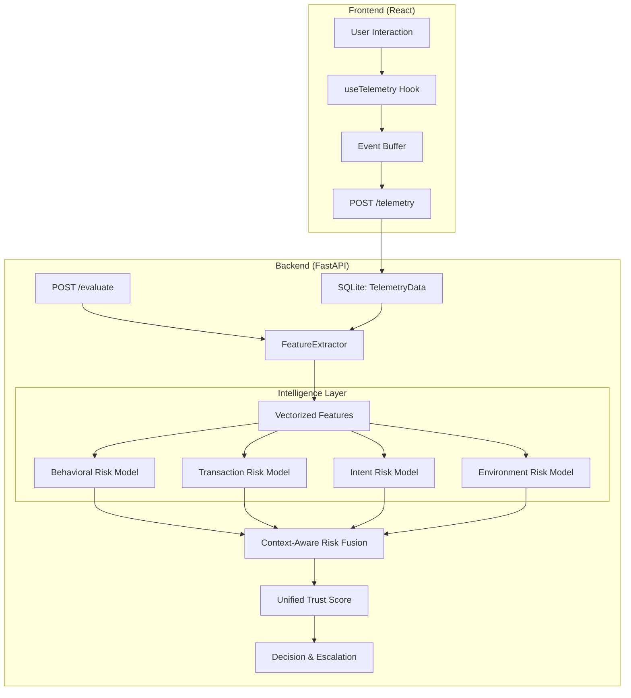

# AURA Intelligence Pipeline: Technical Documentation

## 1. System Architecture
The AURA Security Platform utilizes a multimodal intelligence pipeline that processes real-time telemetry from the frontend, extracts high-dimensional features, and executes inference through a suite of domain-specific machine learning models.

## 2. Telemetry Flow
AURA captures continuous behavioral signals to verify identity without interrupting the user experience.
1. **Dwell Time:** Milliseconds a key is held down.
2. **Flight Time:** Latency between keyup and next keydown.
3. **Mouse Velocity:** Pixels per millisecond, sampled every 150ms.
4. **Path Straightness:** Efficiency of cursor trajectory (Entropy proxy).

## 3. Model Inventory
| Model | Dataset | Algorithm | Target Metric (AUC) |
| :--- | :--- | :--- | :--- |
| **Behavioral** | CMU Keystroke | RandomForest | 0.995 |
| **Transaction**| Feedzai BAF | XGBoost | 0.789 |
| **Intent** | SMS Spam | LogReg + TF-IDF | 0.993 |
| **Environment**| Simargl 2021 | RandomForest | 1.000 |

## 4. Risk Fusion Algorithm
The `RiskEngine` uses **Context-Aware Weighted Averaging (CAWA)**. 
- **Weights:** Base weights are defined in `config/risk_weights.yaml`.
- **Dynamic Boosting:** If a high-value transfer is detected (> $5,000), the Transaction weight is boosted by 50%.
- **Confidence Adjustment:** If the primary risk driver has low confidence, the final trust score is penalized to avoid false positives.

## 5. Decision Matrix
| Score Range | Decision | Escalation Level | Action |
| :--- | :--- | :--- | :--- |
| 0.0 - 0.2 | ALLOW | 1 | Transparent monitoring |
| 0.2 - 0.4 | CHALLENGE | 2 | SMS OTP / Email Verification |
| 0.4 - 0.7 | RESTRICT | 3 | Block high-value transfers |
| 0.7 - 1.0 | CONTAIN | 4 | Session Termination / Account Lock |
